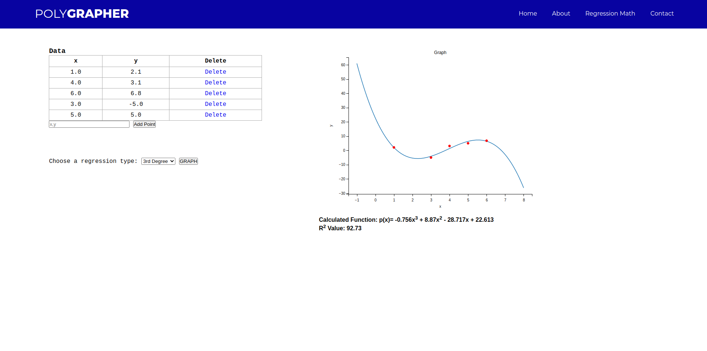

### Polynomial Best Fit Grapher by Tanner Skluzacek

live demo link: https://polygrapher.herokuapp.com/ 

User interface preview:

In this project, I created a Python Flask web application that allows users to add data and view a selected best fit curve. To do this, I used the NumPy Python library to handle the linear algebra and mpld3 graph library to display the data. 
